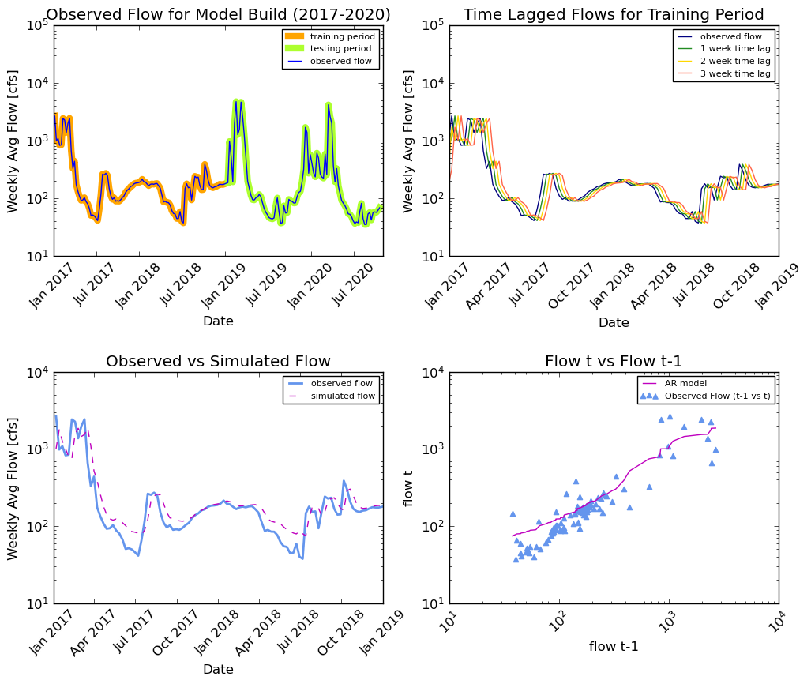

# Code Submission 1, Week 8
###### Code author: Mekha (modified code from Laura)
###### Code reviewer: Laura

#### Grade 
 - 6/6  Great  job!
 - Readability: 3
 - Style: 3 
 - Code: 3

 - Really nice work. I like the function  you defined and  your use of loops is great. 
 - I made a few suggestions but overall  I like your setup. 

---
#### WRITTEN ASSIGNMENT

*1. A brief summary of the AR model you built and why. Use whatever graphs you find helpful.*

I tested several training and testing periods, with models based on one, two, and three time lags. Beyond three lags, I expected the peak flows to have to great an impact on subsequent flow predictions. Intuitively, I thought I should focus on a dataset from recent years, rather than including data all the way back to 1989. Also, because we are predicting weekly flows and not annual flows, I felt justified to restrict the model dataset to only a few years. From previous weeks' analysis, I know 2019 was a dry year similar to 2020 so far. I also know there were El Nino conditions in 2015-2016, so I decided to include data only back to 2017. After checking the r2 value for various combinations of training periods and models with 1-3 time lags, I got the highest r2 value for a model with 3 weekly time lags, a training period of 2017-2018, and a testing period from 2019-2020. The graphs below summarize my AR model.

*2. An explanation of how you generated your forecasts and why (i.e. did you use your AR model or not?)*

My AR model over predicts flow, especially during low flow periods with decreasing trends, so I did not use my AR model forecasts. My forecasts for the 1 week and 2 week forecast entries are still based average weekly flows from the prior two weeks of data. I have previously reviewed the running weekly and two week average and notice little variability over time, with recent weekly flows increasing slightly. My 1 week forecast is the average weekly flow from the previous week. My 2 week forecast is the average weekly flow from the previous two weeks (since there is a little more uncertainty two weeks out).

*3. A brief summary of what you got out of the peer evaluation. How did you make your script better?*

* Improved the clarity of my function (Patrick and I actually created similar functions, so he was able to provide suggestions to make it more clear)
* Improved script organization 
* Improved ideas for graphing (create subplots so optional graphing occurs in just one block of code)

*4. Describe the part of your script that you are most proud of and why.*

It is very simple, but I am most proud of becoming more comfortable with indexing over the past week of class and after revising this script. I had been struggling with indexing to pull out specific data and indexing in for loops, but I was able to better understand both after working on this script (lines 162-171 and lines 183-190). I am also proud of the setup of my function which sets up an array of zeros and replaces the zeros with calculated values. I created this setup last week and was not sure if it was the most efficient way to store the values, but then in class on 10/15 we went over this exact method.

---
#### FORECAST VALUES FROM CODE

* 1 week forecast based on AR model: 96.04 cfs
* 2 week forecast based on AR model: 120.80 cfs

* 1 week forecast based on last week's average flow: 69 cfs
* 2 week forecast based on last two weeks' average flow: 65 cfs

---
#### CODE REVIEW

1. Is the script easy to read and understand?

2. Does the code follow PEP8 style consistently?

3. Is the code written succinctly and efficiently?
