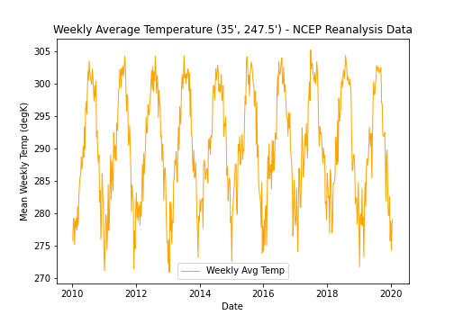

# Homework 12 Markdown
*Mekha Pereira*

*11/22/2020*

---------
I did not turn in homework 12 last week because I was busy with work. I still wanted to practice with netcdfs, so I downloaded daily average surface temperature data from a NOAA reanalysis dataset. I was able to use the starter code to pull out data for one location, create a timeseres plot, convert the data to a dataframe, and convert daily values to weekly average values. Just uploading my plot and code so I have this for my own future reference. 

