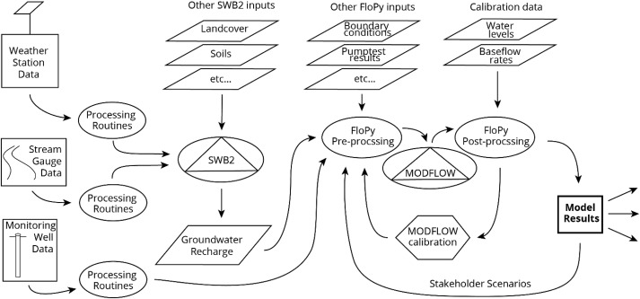

## Homework 14 Markdown
Mekha Pereira

11/30/2020

---------
##### Question 1. What is the paper or project you picked? Include a title, a link to the paper and a 1-2 sentence summary of what its about.

Title: Collaborative groundwater modeling: Open-source, cloud-based, applied science at a small-island water utility scale

Link: https://www.sciencedirect.com/science/article/pii/S136481521930934X

Summary: This paper highlights a cloud-based workflow for collaborative groundwater modeling process by researchers at the American Samoa Power Authority and at the University of Hawaii. By using open source python based tools, jupyter notebooks, and hosting all the resources on github, it was possible to make data collection and modeling resources immediately available to remote stakeholders. The case study presented in this paper was for the island of Tutuila in Samoa, which is a groundwater dependent area with major contamination and salinity issues. The American Samoa Power Authority and at the University of Hawaii collaborated on data collection, water budget estimates, and development of a groundwater model. I liked this workflow diagram included in the paper.

##### Question 2. What codes and/or data are associated with this paper? Provide any link to the codes and datasets and a 1-2 sentence summary of what was included with the paper (i.e. was it a github repo? A python package? A database? Where was it stored and how?)

Github repo link: https://github.com/UH-WRRC-SWB-model/SWB2-Tutuila

The paper included github repo links to both the open source code for the groundwater modeling framework, and a link to a static version of the data/code/model output for the Tutuila Water Budget Model described as the case study in the paper. The link above is for the Tutuila Water Budget Model repo. There is a folder with the raw data files, model executable, and a jupyter notebook with the code to run the model and produce figures of output.

##### Question 3. Summarize your experience trying to understand the repo: Was their readme helpful? How was their organization? What about documentation within the code itself?

The repo was very well organized and easy to follow. It contained a PDF of the paper, a folder with the raw data to run the model, the model executable, and a model workspace folder where the model is run ad figures of output are created. There was a single README file in the main repo with basic instructions on how to run the model which included: copying the repo, downloading large data files from the Github releases tab and saving the data to a specified folder, downloading the model execitable, and running the model and creating figures through a script in a jupyter notebook.

The documentation within the code was also good. There were comments throughout the script (covert to raster, change projection, etc.) that made the code easier to understand. I think the model is run using the separate model executable, and the majority of the script creates figures with the model output. It would have been more helpful for the author to take advantage of the fact that the script was set up in a jupyter notebook, and add more detailed narration in markdown cells throughout the script and break up the code. Instead, there are no markdown cells in the notebook, and the entire code is in a single cell. The README indicates this was done so that the code could easily be copied into a python script and run that way instead of run from the notebook.

##### Question 4. Summarize your experience trying to work with their repo: What happened? Where you successful? Why or why not?

Considering the repo was well organized and there was a README providing some direction, I was hopeful that I would be able to sun the script and reproduce figures! But I was not successful...

I was able to successfully clone the repo, download additional datasets and executables, and view the jupyter notebook. But I ran into issues right at the beginning installing the necessary packages and modules. I setup a new environment and tried installing all packages listed at the start of the jupyter notebook. I attempted many different ways but was unable to install arcpy which after some googling, I figured out is not compatible with my version of python (the script was written in an older version of python 3.6). I was not able to solve this issue within the 1hr time frame, and the script could not be run without acrpy because the majority of the results are figures created using that package.

The advantage of providing the script in a jupyter notebook is that the code was already run when I opened the notebook, so I could see the final output (graphs and figures). I find this to be a helpful way to share code, so that another user can see what the end goal is before trying to run the code themselves.

##### Question 5. Summarize your experience working with the data associated with this research. Could you access the data? Where was it? Did it have a DOI? What format was it in?

The raw data associated with the model was all GIS files (shapefiles, tifs, and other gridded data files). Most files were small enough that they were included in the repo in the appropriate folder and easily obtained by cloning the entire repo. One large .shp file needed to be downloaded separately and added to the raw data file, and there were clear instructions on how to do that. Within the data folder, there were several subfolders organizing the data by type (soil, recharge, infiltration, land use, etc.), which is helpful when file names are not descriptive, and when there are multiple files associated with each shapefile.

##### Question 6. Did this experience teach you anything about your own repo or projects? Things you might start or stop doing?

Lots of ideas on ways to be detailed and organized if I need to share my scripts in the future:

* List packages that need to be installed in the README itself. For a beginner like me, it was not obvious which packages were being imported from the standard python library and which needed to be installed.
* Add notes about common errors when installing packages and trying to get the script to run and the associated fix/workaround.
* Have a README file in each main folder within my repo describing the files within that folder.
* In the future, I plan to have my data better organized with subfolders describing the data type (streamflow, GIS files, precipitation, etc.).
* Provide the script in two forms: 1) a jupyter notebook with detailed comments that has been run so another user can see the desired output (consider this a static form of the script), and 2) a .py python script for the user to run and manipulate.
