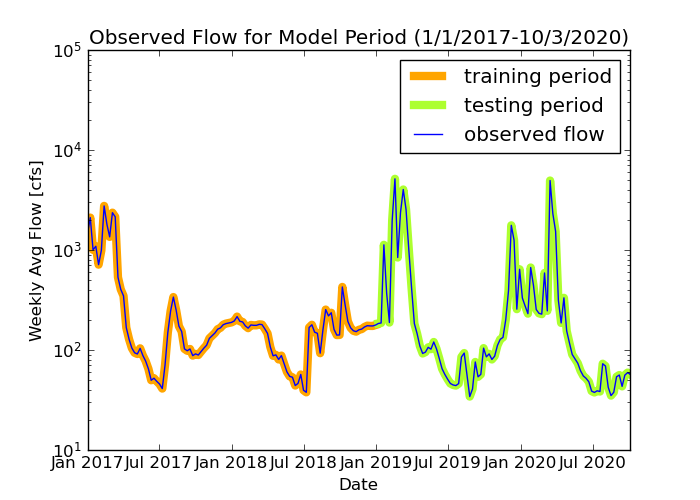
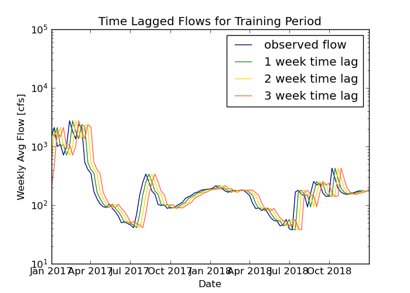
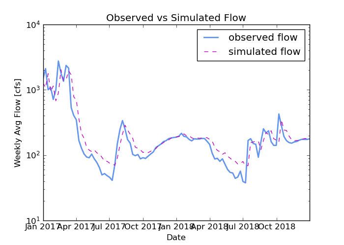
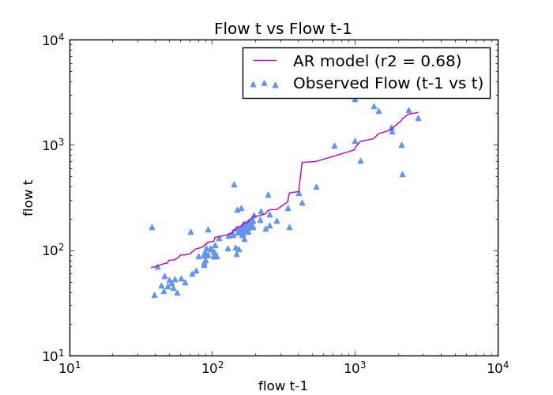

# Homework 6 Markdown
*Mekha Pereira*

*10/03/2020*

___
### Grade
3/3 - Great work. Nice analysis and great job with the  graphs!

---------
## Assignment Questions

*Question 1.* Provide a summary of the AR model that you ended up building, including (1) what you are using as your prediction variables, (2) the final equation for your model and (3) what you used as your testing and training periods. In your discussion please include graphical outputs that support why you made the decisions you did with your model.

I tested several training and testing periods, with models based on one, two, and three time lags. Intuitively, I thought I should focus on a dataset from recent years, rather than including data all the way back to 1989. From previous weeks analysis, I know 2019 was a dry year similar to 2020 so far. I also know there were El Nino conditions in 2015-2016, so I decided to include data only back to 2017. After checking the r2 value for various combinations of training periods and models with 1-3 time lags, I got the highest r2 value for a model with 3 time lags, a training period of 2017-2018, and a testing period from 2019-2020. I think my intuition may be way off because two years of historical data seems like a very short training time for a model. But on the other hand, we are predicting weekly flows and not annual flows, so I thought it was justified to restrict the historical data used to create the model to only go back to 2017. To summarize:

1) Prediction variables: avg weekly flow from prior week, priors 2 weeks, and prior 3 weeks (flowt-1, flowt-2, and flowt-3)

2) Equation: flowt = 34.2 + 0.68flowt-1 - 0.03flowt-2 + 0.19flowt-3 *NOTE: based on the coefficient on flowt-2, I could leave that variable out and end up with nearly the same results. I only realized this at the end, so I left as is.*

3) Testing period: weekly average flows from 2017-2018. Training period: weekly average flows from 2019 through October 4, 2020

The following timeseries graph plots the observed weekly average flow, and highlights the training period in orange and the testing period in green.

The following time series shows the three sets of lagged weekly flows used as predictive variables in my autoregressive model. Looking at the location of peaks of lagged data relative to the observed flow, I was not comfortable lagging the data more than 3 weeks.

*Question 2.* Provide an analysis of your final model performance. This should include at least one graph that shows the historical vs predicted streamflow and some discussion of qualitatively how you think your model is good or bad.

My model generally captures the trend in the data. But it does not seem suited to predict current streamflow conditions. The graph below show observed versus simulated weekly average flow. It appears that during low flow periods on a downward trend, the model tends to overpredict.

The scatter plot below also shows that especially on the low end of flows, the model overpredicts.

*Question 3.* Provide discussion on what you actually used for your forecast. Did you use your AR model, why or why not? If not how did you generate your forecast this week?

I did not use my AR model to make this week's forecast because it seems to overpredict during low flow periods, like the current period. Based on the average flow over the past three weeks, my model predicts that next week's flow will be 82.3 cfs, which is unlikely based on the recent daily flows. For my forecast this week, I will stick to my method of relying on the average over the last two weeks of flow since there has not been too much variation in flow. I used average flow from 9/27-10/3 for the one week forecast (57.3 cfs) and I used the average flow from 9/20-10/3 for the two week forecast (57.9 cfs).
