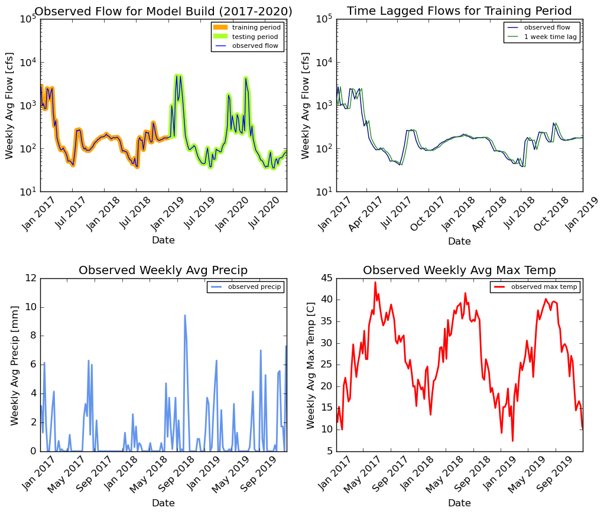

# Homework 9 Markdown
*Mekha Pereira*

*10/26/2020*

---------
## Assignment Questions

*Question 1.* A brief summary of the how you chose to generate your forecast this week.

I created timeseries plots of recent weekly flows. I noticed a fairly steady increasing trend in recent weeks; there has been about a 20 cfs increase over the past 5 weeks. I made my 1 week and 2 week forecast by simply applying the 4 cfs/week increasing rate to last week's average flow. Last week's flow was 80 cfs, so my 1 week forecast is 84 cfs, and my 2 week forecast is 88 cfs.

I was hoping to use my regression model to make my forecast, but ran into an issue with the time period of daymet data. My goal for next week is to obtain data from a different source with recent data, and try to use the new regression model I set up.

3) Testing period: weekly average flows from 2017-2018. Training period: weekly average flows from 2019 through October 4, 2020

*Question 2.* A description of the dataset you added

* What is the dataset? Why did you choose it
  * I chose to add daily precipitation data and maximum temperature data from daymet. These were aggregated to weekly values. I chose to add precipitation data because preciptation events in the area will have a direct impact on streamflow. My rationale for adding temperature data was that Arizona has extended periods of no precipitation events, and there are still other factors that results in changes to streamflow (snowmelt, drought itself). I thought temperature could be a proxy to predict changes we see in flow, even when there is an extended period with no precipitation.
* What location have you chosen?
  * For the daymet data, I specified the geographic coordinates of our Verde River streamgage (34.4483, -111.7892) and downloaded data for the corresponding pixel. In retrospect, I should have chosen a more upstream location for precipitation as a better indicator of flows that will impact our gage.
* Where did you get the data from?
  * Precip and temperature data came from daymet.
* What was your approach to accessing it?
  * I accessed the USGS data using the nwis.get_record function in the dataretreival.nwis package.
  * I accessed the daymat data using URL and formatting as json data. I used the exmaple in the starter code and modified the URL and data value to also get max temperature data.
  * The most challenging part was formatting the date to match the datetime format of the USGS data.
* NOTE: So far, I have added these two new time series, and change my regression model. It was previously an autoregressive model built of three weekly lags in streamflow. Now, the inputs to the regression model are 1 week lagged flow, weekly avg precipitation, and weekly avg max temperature. The r2 value I got is similar to my previous model. However, the daymet data only goes through the end of 2019, so I was not able to use it to make my 1 week and 2 week forecast. For next week, I will work on importing data from a different source with current data.

*Question 3.* A plot of your additional time series along with your streamflow time series.

The plots below show time series of average weekly precipitation and average weekly maximum temperature from daymet.

