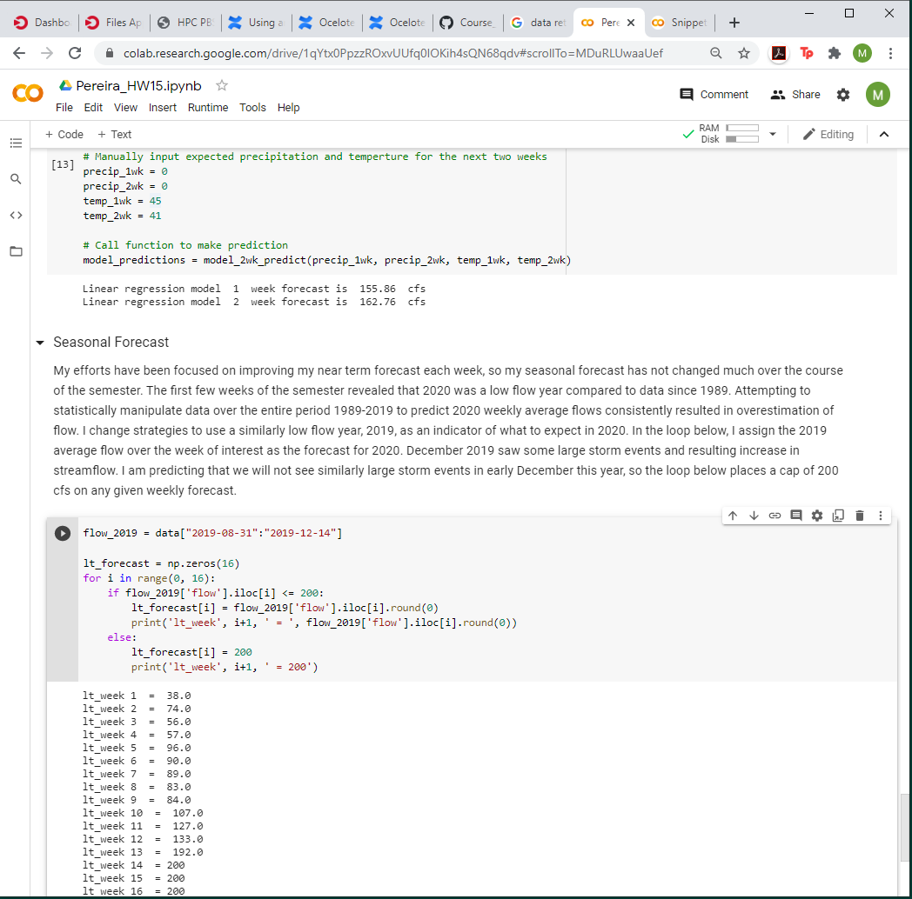

## Homework 15 Markdown
Mekha Pereira

12/06/2020

---------
#### What resources did you request on Ocelote? How long did you wait in the queue for your job to run and how long did it take to run?

Resources requested: 1 cpu, 6gb memory, 5 minutes of wall time which equates to 5 minutes of cpu time. I waited in the queue for less than 10 seconds each time I submitted a job to run my python script, and my script ran in about the same amount of time.

#### What was the most confusing part to you about setting up and running your job on Ocelote?

I had issues with trying to place my python script and .pbs file in a folder called "HAS_tools" within my main directory, and run it from that folder. I kept getting an error saying no such directory found. I went to Patrick's office hours and we spent over half an hour trouble shooting, and ended up needing to run from my main directory. My next issue was that though I loaded the python module, I kept getting an error saying pandas module was not found. This was only resolved once I setup my environment to be active all the time, through vi ~/.bashrc. Still not sure why loading the python module and activating my environment did not work.

One plus side of troubleshooting over zoom with Patrick was that I became more comfortable navigating in a terminal window and learned some new useful commands.

#### Question 3. Where else did you run your job? How did the setup compare to your run on Ocelote?

I ran a jupyter notebook on Google Colab (screenshot below of my last two code cells in my notebook and their outputs). The process was very easy, I simply uploaded my jupyter notebook and ran it cell by cell. The only package I had to add was a pip install of 'dataretreival' (the nwis package to download USGS data). All other packages I imported were already available. I did not run into any tricky package or path issues like I did with submitting a job to Ocelote. MUCH easier. This definitely seems like I tool I would use in the future to share simple scripts. At work, I have co-workers who have developed simple scripts for various tedious data process tasks, but many people in the office don't know they are available and end up duplicating efforts or wasting time. Google Colab seems like a great way to manage simple scripts and have them accessible to anyone.

#### Question 4. What questions do you still have after doing this?

I wasn't able to successfully get my .pbs file to point to a folder within my main directory, so I would like to understand that error. Also want to explore dockers because I like the idea of being able to share code in a container that has the environment already built, considering I had some issues setting up my environment.
