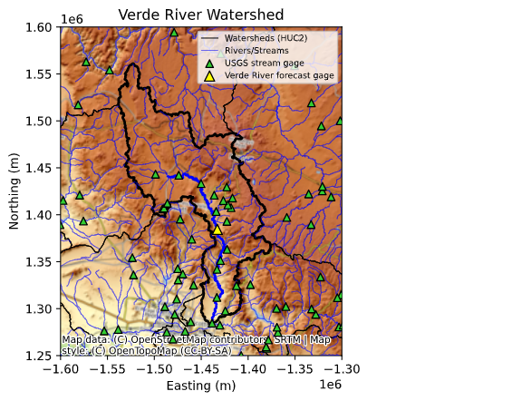
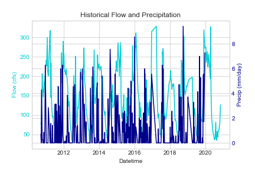
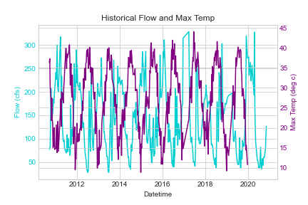
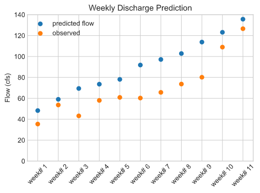

# Team MJJ Forecast
*Mekha, Jill, Jake*

*11/09/2020*
__
## Grade
3/3 - Wow really nice graphs! Good work doing this collaboratively.

---------
#### Forecast Values

Short-term forecast: **133.12** cfs for 1 week forecast and **157.45** cfs for 2 week forecast

Seasonal forecast:

|Week 1|Week 2|Week 3|Week 4|Week 5|Week 6|Week 7|Week 8|Week 9|Week 10|Week 11|Week 12|Week 13|Week 14|Week 15|Week 16|
|:---- | ---- | ---- | ---- | ---- | ---- | ---- | ---- | ---- | ----- | ----- | ----- | ----- | ----- | ----- | ----- |
|  32.0|  49.9|  48.6|  48.9|  51.2|  69.9|  77.3|  73.9|  77.8|   97.1|  121.0|  129.0|  135.0|  145.0|  154.0|  166.0|

---------
#### Summary of Collaboration

<ins>How We Put the Pieces Together</ins>

Jake is near the top of the leader board for the 1 and 2 week forecast, so we decided to use his script as the basis for our 1 and 2 week forecast. Based on the RMSE plots from last week, Jill's error was pretty low for the 16 week forecast so far, so we decided to use her script as the basis for our long term forecast. We decided to use Mekha's script for our map, because its extent and choice of layers made the Verde Watershed easiest to visualize.

<ins>Who Did What</ins>
* Step 1: Mekha took first pass at combining Jake's two week forecast script with Jill's 16 week forecast script, getting everything running, and doing some code cleanup and organization. Mekha also incorporated temperature data into Jake's regression model.
* Step 2: Jake incorporated temperature into the 1 and 2 week forecast loop based on the new regression model, updated the script, and moved functions into a separate script.
* Step 3: Jill added code for the complete 16 week forecast, cleaned up the script, and added map and time series graphs of the model input data (streamflow, precipitation, and temperature) to the markdown
* Step 4: Mekha took first pass at markdown file, and Jake and Jill reviewed/revised

---------
#### Summary of forecast approach

A 1 week, 2 week, and 16 week long-term forecast was made for the Verde River stream gage near Camp Verde, shown on the map below in yellow. The gage is located midway through the Verde River. Data from additional USGS gages (in green) upstream could be used to improve the forecast approach in the future.

  

<ins>1 and 2 Week Forecast Approach</ins>

For the 1 and 2 week summary, we used a linear regression model with the following input variables: average weekly flow from 1 week prior, average weekly flow from 2 weeks prior, average weekly flow from 3 weeks prior, average weekly precipitation, average weekly max temperature, and average weekly max temp from 1 week prior. Observed streamflow from recent weeks is an intuitive predictor of future streamflow. Precipitation has become a more important predictive variable with winter rains beginning. And average maximum temperature is a valuable predictive variable for streamflow during Arizona's extended periods of no precipitation because temperature can act as a proxy for other processes that impact streamflow, such as snowmelt and leaf out in the spring. Generally speaking, recent streamflow and precipitation will have a direct relationship with predicted flow, but temperature will have an inverse relationship with predicted flow. This is reflected in the graphs of the input variables shown in the first two figures below. The performance of the model relative to observed streamflow is shown in the third figure below. The third graph shows how a variant of the two week model acts compared to observations. The model is slightly over estimating flow but looking at the first two weeks the difference seems minor.

<ins>Long-Term Forecast Approach</ins>

For the 16 week forecast, the approach used was to focus on observed historical minimum precipitation values. This approach recognizes that 2020 has been a low flow year. Instead of weekly average flow, a dataframe of weekly minimum flows was created. Then for each of the 16 weeks of interest, the minimum from the period 1989-2019 was chosen as the 16 forecast value for 2020.
